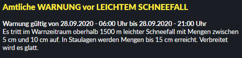

# DWD-Unwetterwarnungen-JS

With this JavaScript file it is possible to analyze the JSONP file of the DWD and to display it in any HTML file.

### Important Information:

With this JSONP File its only possible to show weather warnings for a district not for a single city. 

### Example - Preview:


### Change warncellid
Find your warncellid here: https://www.dwd.de/DE/leistungen/opendata/help/warnungen/cap_warncellids_csv.html
```js
var warncellid = '109172000';
```

### HTML File
```html
<div id="warnungen">
    <ul id="warnungsul"></ul><!--dynammically filled by js file-->
</div>
```

# Info
This is my first open source project and also my first JS project. If you have any suggestions for improvement or tips,... please let me know :) 

# License
**Free Software, Hell Yeah!**
